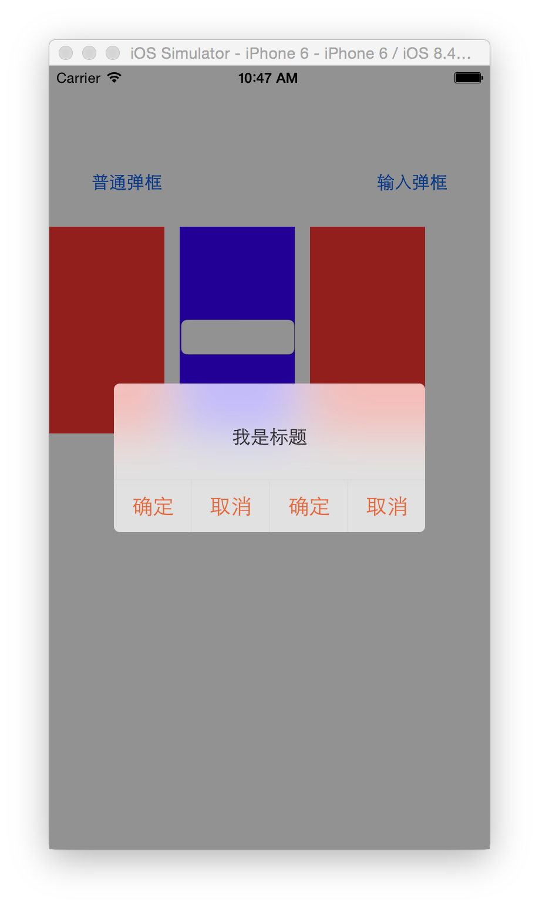
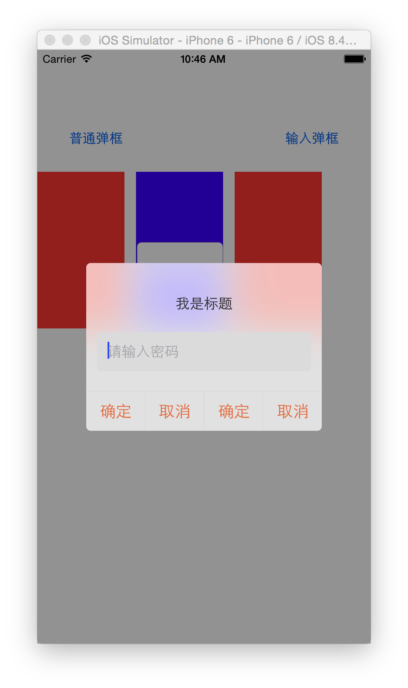
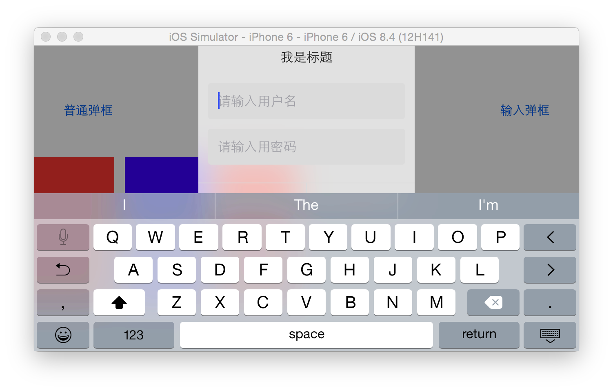
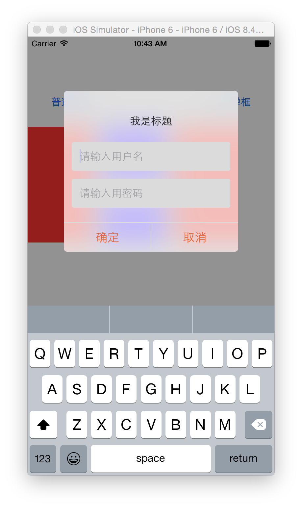

# XXBAlertView
#和UIAlertView 一样好用

## ios8上做了横竖屏适配，ios7上目前只支持竖屏 会后续更新
支持pod
```c
pod 'XXBAlertView',:git => 'https://github.com/sixTiger/XXBAlertView'
```

``` c
- (IBAction)normalAction:(UIButton *)sender {
    XXBAlertView *alertView = [[XXBAlertView alloc] initWithTitle:@"我是标题" delegate:self cancelButtonTitle:nil otherButtonTitles:@"确定",@"取消",nil];
    alertView.alertViewStyle = XXBAlertViewStyleLoginAndPasswordInput;
    [alertView show];
}

- (IBAction)inputAction:(id)sender {
}
- (void)alertView:(XXBAlertView *)alertView clickedButtonAtIndex:(NSInteger)buttonIndex
{
    NSLog(@"%@",@(buttonIndex));
}
```
#iphone的效果图
<br>
<br>
<br>
<br>
